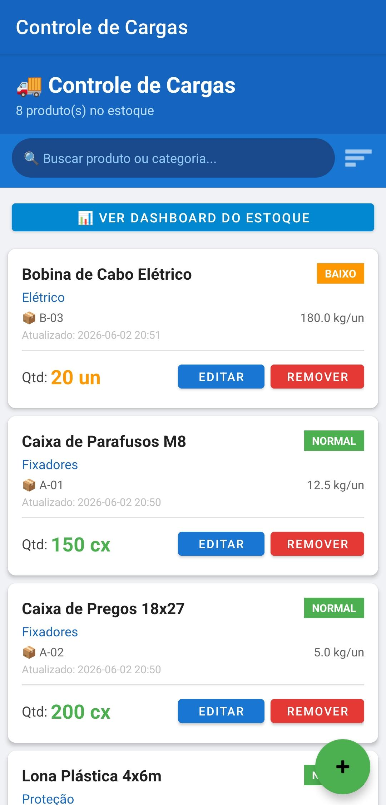
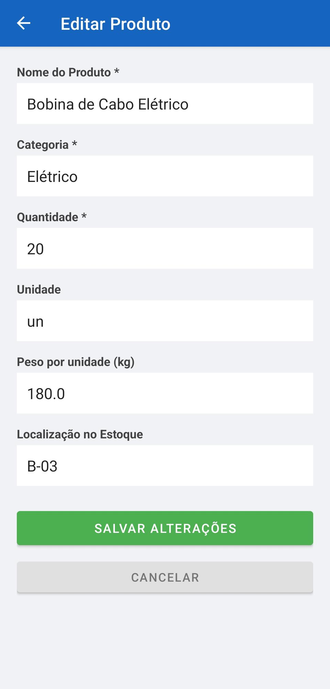
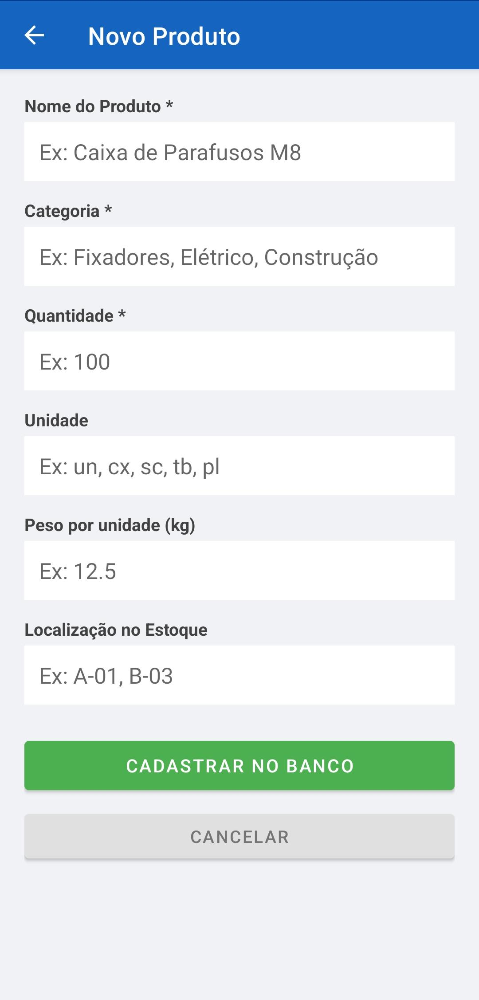
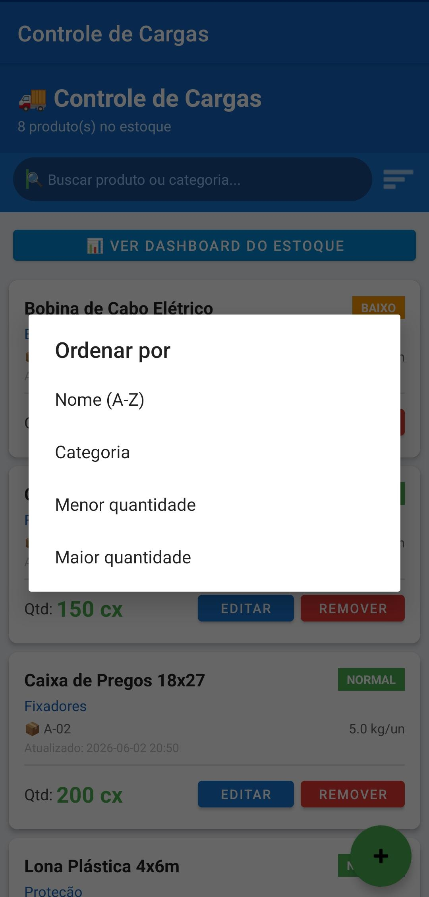
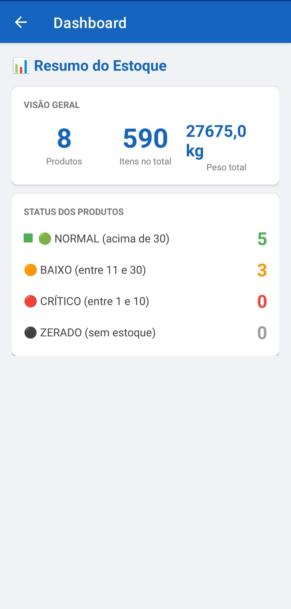
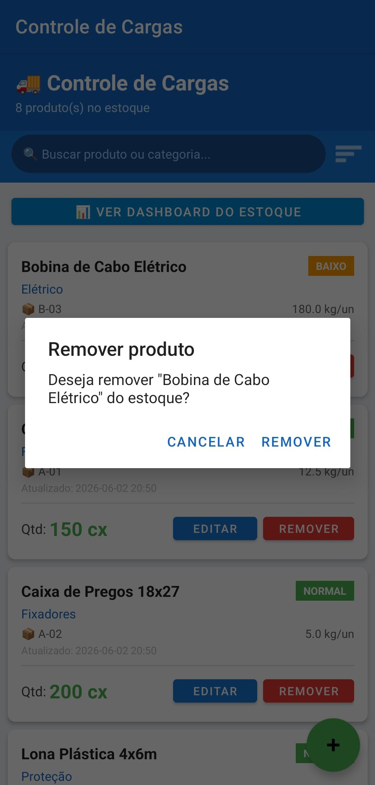

# 📦 Controle de Cargas — App Android

App Android desenvolvido para gerenciamento de estoque e controle de cargas, com banco de dados **SQLite** local. Projeto acadêmico da disciplina de Programação para Dispositivos Móveis.

---

## 📱 Telas do Aplicativo

### Tela Principal — Lista do Estoque
A tela inicial exibe todos os produtos cadastrados com nome, categoria, localização, peso, data de atualização e quantidade. Possui barra de busca para filtrar por nome ou categoria, botão de ordenação e acesso rápido ao Dashboard.



**Indicadores de status:**
| Status | Cor | Quantidade |
|--------|-----|-----------|
| NORMAL | 🟢 Verde | Acima de 30 |
| BAIXO | 🟠 Laranja | Entre 11 e 30 |
| CRÍTICO | 🔴 Vermelho | Entre 1 e 10 |
| ZERADO | ⚫ Cinza | 0 |

---

### Tela de Editar Produto
Ao clicar em **"Editar"**, o app abre o formulário com todos os campos preenchidos para edição — nome, categoria, quantidade, unidade, peso e localização. A alteração é salva diretamente no banco SQLite.



---

### Tela de Novo Produto
Ao clicar no botão **"+"** (FAB verde), é possível cadastrar um novo produto preenchendo todos os campos. O botão se adapta automaticamente para "Cadastrar no Banco" ou "Salvar Alterações" dependendo do contexto.



---

### Ordenação da Lista
Ao clicar no ícone de ordenação, o app exibe um menu com 4 opções de ordenação da lista de produtos.



---

### Dashboard — Resumo do Estoque
Tela de resumo com visão geral do estoque: total de produtos, total de itens, peso total e quantidade de produtos por status (Normal, Baixo, Crítico e Zerado).



---

### Confirmação de Exclusão
Ao clicar em **"Remover"**, o app exibe um diálogo de confirmação. Após a remoção, aparece um **Snackbar** com botão **"DESFAZER"** para restaurar o produto removido.



---

## 🗄️ Banco de Dados

O app utiliza **SQLite**, banco de dados nativo do Android. Não requer conexão com internet ou servidor externo — tudo funciona localmente no próprio dispositivo.

### Estrutura da tabela `produtos`

| Coluna | Tipo | Descrição |
|--------|------|-----------|
| id | INTEGER | Chave primária, auto incremento |
| nome | TEXT | Nome do produto |
| categoria | TEXT | Categoria do produto |
| quantidade | INTEGER | Quantidade em estoque |
| unidade | TEXT | Unidade de medida (un, cx, sc, etc.) |
| peso_kg | REAL | Peso por unidade em kg |
| localizacao | TEXT | Localização no estoque (ex: A-01) |
| data_atualizacao | TEXT | Data e hora da última alteração |

O banco é criado automaticamente na primeira execução com **8 produtos de exemplo**.

---

## ⚙️ Funcionalidades

- ✅ Listar todos os produtos do estoque
- ✅ Indicador visual de status por quantidade (Normal, Baixo, Crítico, Zerado)
- ✅ **Busca** por nome ou categoria em tempo real
- ✅ **Ordenação** por nome, categoria, menor ou maior quantidade
- ✅ **Editar todos os campos** de um produto
- ✅ Cadastrar novo produto
- ✅ Remover produto com confirmação
- ✅ **Snackbar com botão DESFAZER** ao remover produto
- ✅ **Dashboard** com resumo completo do estoque
- ✅ Banco de dados local SQLite (funciona offline)

---

## 🛠️ Tecnologias Utilizadas

- **Linguagem:** Kotlin
- **Banco de dados:** SQLite (via `SQLiteOpenHelper`)
- **UI:** XML Layouts + RecyclerView + CardView + CoordinatorLayout
- **Componentes:** FloatingActionButton, Snackbar, AlertDialog
- **IDE:** Android Studio
- **Min SDK:** API 24 (Android 7.0)

---

## 📂 Estrutura do Projeto

```
app/src/main/
├── java/com/example/controledecargas/
│   ├── Produto.kt                  # Data class modelo
│   ├── DatabaseHelper.kt           # Gerencia o banco SQLite
│   ├── ProdutoAdapter.kt           # Adapter do RecyclerView
│   ├── MainActivity.kt             # Tela principal (lista, busca, ordenação)
│   ├── FormProdutoActivity.kt      # Formulário de adicionar/editar produto
│   └── DashboardActivity.kt        # Tela de resumo do estoque
└── res/
    ├── layout/
    │   ├── activity_main.xml
    │   ├── item_produto.xml
    │   ├── activity_form_produto.xml
    │   └── activity_dashboard.xml
    └── drawable/
        └── bg_busca.xml
```

---

## ▶️ Como Executar

1. Clone o repositório
2. Abra no **Android Studio**
3. Conecte um dispositivo Android ou inicie um emulador
4. Clique em **Run ▶️**

O banco de dados SQLite é criado automaticamente na primeira execução com dados de exemplo. Funciona **100% offline**, sem necessidade de servidor ou internet.

---

## 👨‍💻 Autor

Desenvolvido por **Pedro Tersi** — Trabalho Avaliativo PAM2
