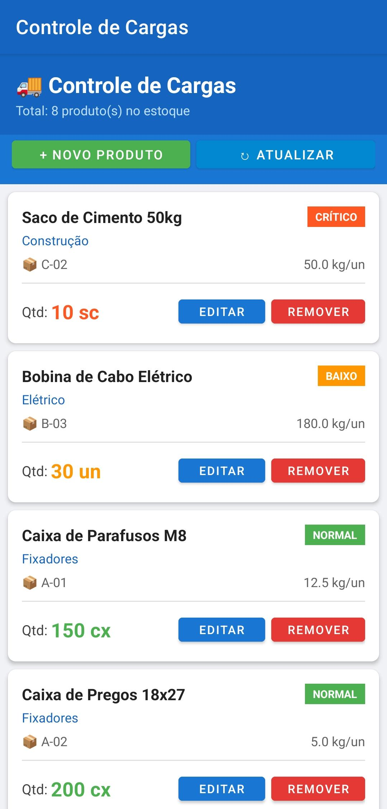
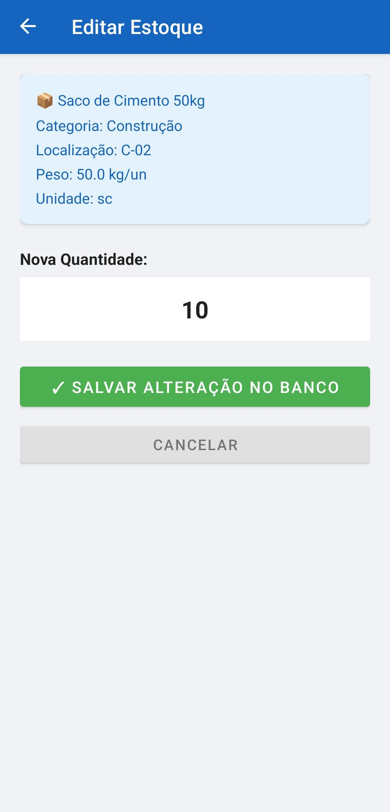
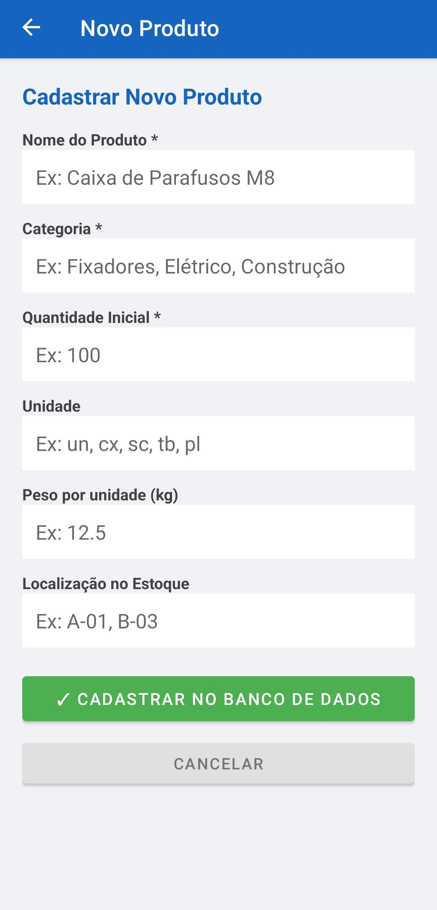
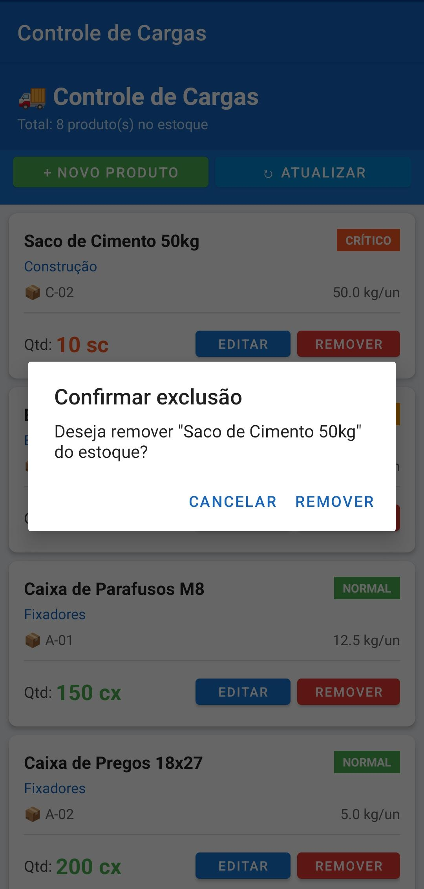

# 📦 Controle de Cargas — App Android

App Android desenvolvido para gerenciamento de estoque e controle de cargas, com banco de dados **SQLite** local. Projeto acadêmico da disciplina de Programação para Dispositivos Móveis.

---

## 📱 Telas do Aplicativo

### Tela Principal — Lista do Estoque
A tela inicial exibe todos os produtos cadastrados no estoque com informações de nome, categoria, localização, peso por unidade e quantidade atual. Cada produto tem um indicador de status colorido baseado na quantidade disponível.

> 

**Indicadores de status:**
| Status | Cor | Quantidade |
|--------|-----|-----------|
| NORMAL | 🟢 Verde | Acima de 30 |
| BAIXO | 🟠 Laranja | Entre 11 e 30 |
| CRÍTICO | 🔴 Vermelho | Entre 1 e 10 |
| ZERADO | ⚫ Cinza | 0 |

---

### Tela de Editar Estoque
Ao clicar em **"Editar"** em qualquer produto, o app abre a tela de edição com as informações do produto e um campo para digitar a nova quantidade. A alteração é salva diretamente no banco de dados SQLite.

> 

---

### Tela de Novo Produto
Ao clicar em **"+ Novo Produto"**, é possível cadastrar um novo item no estoque preenchendo nome, categoria, quantidade inicial, unidade, peso por unidade e localização no estoque.

> 

---

### Confirmação de Exclusão
Ao clicar em **"Remover"**, o app exibe um diálogo de confirmação antes de excluir o produto do banco de dados, evitando exclusões acidentais.

> 

---

## 🗄️ Banco de Dados

O app utiliza **SQLite**, banco de dados nativo do Android. Não requer conexão com internet ou servidor externo — tudo funciona localmente no próprio dispositivo.

### Estrutura da tabela `produtos`

| Coluna | Tipo | Descrição |
|--------|------|-----------|
| id | INTEGER | Chave primária, auto incremento |
| nome | TEXT | Nome do produto |
| categoria | TEXT | Categoria do produto |
| quantidade | INTEGER | Quantidade em estoque |
| unidade | TEXT | Unidade de medida (un, cx, sc, etc.) |
| peso_kg | REAL | Peso por unidade em kg |
| localizacao | TEXT | Localização no estoque (ex: A-01) |
| data_atualizacao | TEXT | Data e hora da última alteração |

O banco é criado automaticamente na primeira execução do app com **8 produtos de exemplo**.

---

## ⚙️ Funcionalidades

- ✅ Listar todos os produtos do estoque
- ✅ Indicador visual de status por quantidade (Normal, Baixo, Crítico, Zerado)
- ✅ Editar quantidade de um produto
- ✅ Cadastrar novo produto
- ✅ Remover produto com confirmação
- ✅ Banco de dados local SQLite (funciona offline)

---

## 🛠️ Tecnologias Utilizadas

- **Linguagem:** Java
- **Banco de dados:** SQLite (via `SQLiteOpenHelper`)
- **UI:** XML Layouts + RecyclerView + CardView
- **IDE:** Android Studio
- **Min SDK:** API 24 (Android 7.0)

---

## 📂 Estrutura do Projeto

```
app/src/main/
├── java/com/estoque/controle/
│   ├── Produto.java                  # Classe modelo
│   ├── DatabaseHelper.java           # Gerencia o banco SQLite
│   ├── ProdutoAdapter.java           # Adapter do RecyclerView
│   ├── MainActivity.java             # Tela principal (lista)
│   ├── EditarProdutoActivity.java    # Editar quantidade
│   └── AdicionarProdutoActivity.java # Cadastrar novo produto
└── res/
    └── layout/
        ├── activity_main.xml
        ├── item_produto.xml
        ├── activity_editar.xml
        └── activity_adicionar.xml
```

---

## ▶️ Como Executar

1. Clone o repositório
2. Abra no **Android Studio**
3. Conecte um dispositivo ou inicie um emulador
4. Clique em **Run ▶️**

O banco de dados é criado automaticamente na primeira execução com dados de exemplo.

---

## 👨‍💻 Autor

Desenvolvido por **Pedro Tersi** — Trabalho Avaliativo PAM2
